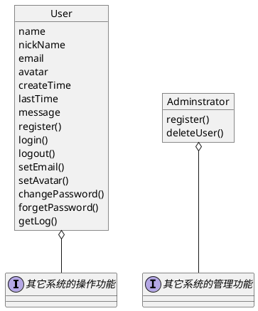
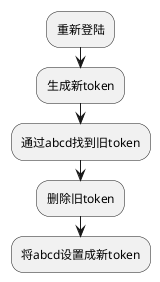

<!-- @import "[TOC]" {cmd="toc" depthFrom=1 depthTo=6 orderedList=true} -->
<!-- code_chunk_output -->

1. [用户系统](#用户系统)
    1. [需求](#需求)
    2. [功能实现](#功能实现)
        1. [用户凭证 token](#用户凭证-token)
            1. [token的生成](#token的生成)
            2. [新token覆盖旧token](#新token覆盖旧token)
        2. [普通用户与管理员](#普通用户与管理员)
            1. [权限验证](#权限验证)
        3. [修改密码流程](#修改密码流程)
        4. [修改验证邮箱流程](#修改验证邮箱流程)
        5. [忘记密码流程](#忘记密码流程)
        6. [修改用户头像](#修改用户头像)
        7. [账号日志](#账号日志)
    3. [唯一性检测](#唯一性检测)
    4. [安全（TODO）](#安全todo)

<!-- /code_chunk_output -->

# 用户系统
## 需求
实现账号的注册登陆、修改密码、设置邮箱等账号功能。普通用户拥有其它系统提供的操作功能，管理员额外拥有其它系统提供的管理功能。


## 功能实现
### 用户凭证 token
token是用户凭证，用户登陆后取得token，大部分操作先header或cookie中提取出token才允许操作。这里设定token有效时间为1小时，且重新登陆后会使旧token无效。
```sequence
title:token 生成与使用
客户端->服务器: 1.账号登陆
Note over 服务器: 在MySQL核对账号密码正确
Note over 服务器: 生成token并保存在redis
服务器->客户端:2.返回用户信息与token
Note over 客户端: 某个操作
客户端->服务器: 3.调用某个操作API
Note right of 客户端:请求中header或cookie包含token
Note over 服务器:在redis验证token
Note right of 服务器:若token失效则要求用户重新登陆
服务器->客户端:4.返回调用API结果
Note over 客户端: 操作成功
```
#### token的生成
token根据用户名name与时间time经摘要算法计算出来，并保存在redis中。为了实现同一个用户同一时间内只允许有一个token，实现时会向redis插入两条数据:
```puml
note "账号abcd登陆后生成token:b0616ad8b668f33ff4e623cd70b40225" as N1
object b0616ad8b668f33ff4e623cd70b40225
object abcd

b0616ad8b668f33ff4e623cd70b40225 : name="abcd" 
b0616ad8b668f33ff4e623cd70b40225 : 其它用户信息数据 

abcd : b0616ad8b668f33ff4e623cd70b40225

b0616ad8b668f33ff4e623cd70b40225--abcd  

note left of b0616ad8b668f33ff4e623cd70b40225 : hashes结构

```
#### 新token覆盖旧token
token会在生存时间过后被redis自动删除（两条数据都删）。当在生存时间内用户重新登陆，新token覆盖旧token，流程图如下：

### 普通用户与管理员
普通用户与管理员通过权限组id(group_id)进行区分。

0. 普通用户：正常使用功能
1. 管理员：拥有管理权限
#### 权限验证
权限管理并不需要太细，按组分权限即可。
```sequence
管理员->服务器: 某个需要权限验证的操作
Note over 服务器:根据token从redis中取出其group_id
Note over 服务器:在权限列表验证这操作是否包含此group_id
服务器-->管理员:操作成功
```

### 修改密码流程
输旧密码与新密码，旧密码正确才会修改成新密码。
### 修改验证邮箱流程
分两个步骤：
1. 重输密码验证成功后，由服务器生成sensitiveToken，并给目标邮箱发送邮件。
2. 用户点击邮件里的url（包含sensitiveToken与所要设置的email地址），由服务器修改数据库。
sensitiveToken的组成：sensitiveToken:name，有效时间30分钟。
```sequence
用户->服务器:1.重输密码正确后修改邮箱
Note over 服务器:生成sensitiveToken
服务器->用户邮箱:2.发送验证邮件
用户-->用户邮箱:3.点击邮件中的网址
用户邮箱->服务器:4.修改邮箱成功
```
### 忘记密码流程
用户填入邮箱，从数据库里寻找邮箱并修改随机密码，将用户名与新的随机密码一同发送至邮箱当中。
```sequence
Note over 用户:若用户之前没有设置用户邮箱，只能联系管理员
用户->服务器:1.忘记密码填写用户邮箱
Note over 服务器:由用户邮箱找到用户名
Note over 服务器:生成新的用户密码
服务器->用户邮箱:2.发送带有用户名与密码的邮件
用户-->用户邮箱:3.获取用户名与密码

```
### 修改用户头像
头像图片上传只允许上传指定图片格式，上传后以uuid命名。图片上传后由nginx直接开启缓存可直接GET访问取得，所以程序与nginx路径要一致。如 nginx的图片访问路径为/var/www/images,那么程序的配置文件imagePath也应当为此值。图片上传后会返回图片名，用户头像指向新的图片名。
【有待优化】将有用的图片移入非临时文件夹，临时文件夹里的图片可以定期删除以节省空间。

### 账号日志
所有请求最原始的数据都由nginx保存下来，系统本身日志文件保存到/log，每个用户的动作的日志文件保存到/log/user/{name}.log。

## 唯一性检测
用户注册时的账号名，设置用户的邮箱名，用户昵称这三个都需要保证唯一性，不可重复。
在redis中有三个set结构数据，保存已经存在的账号名，邮箱名，用户昵称，用于唯一性检测，防止重复使用。
redis初次启动时从数据库中读取，每次这三个值有增改删操作时同步操作redis，可以编写定时任务每天晚上三点执行一次再初始化，以保证每天与mysql数据同步。(优化：mysql在这三个字段列设置udf，保证redis保持与mysql相同,保证强一致性。)

## 安全（TODO）
不使用验证码，采用记录IP地址，每个IP地址每分钟请求不超过50次。（待做）后期可用安全检测模块如snyk,nsp等检测一下。


